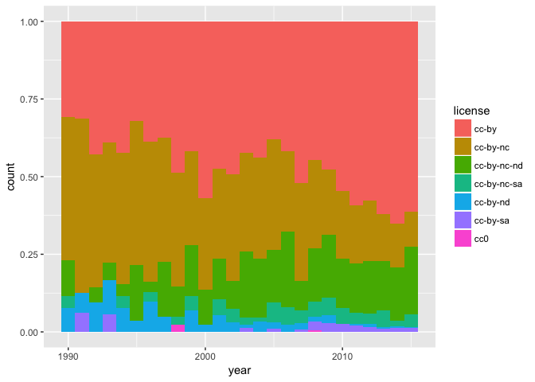
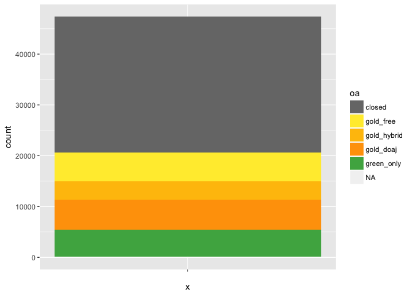

OA paper
================
many

*It's very much a work in progress; feel free to submit pull requests with updates and changes.*

``` r
2+2
```

    ## [1] 4

set up time frames

``` r
articles_timeseries = filter(articles_all, year >= 1990, year < 2016)  # just use last 50yrs
articles_recent = filter(articles_all, year >= 2009, year < 2016)

nrow(articles_all)
```

    ## [1] 100000

``` r
nrow(articles_timeseries)
```

    ## [1] 64778

``` r
nrow(articles_recent)
```

    ## [1] 27816

column names:

``` r
colnames(articles_all)
```

    ##  [1] "doi"                    "evidence"              
    ##  [3] "oa_color"               "best_open_url"         
    ##  [5] "year"                   "found_hybrid"          
    ##  [7] "found_green"            "is_boai_license"       
    ##  [9] "journal"                "publisher"             
    ## [11] "subject"                "green_base_collections"
    ## [13] "license"                "random"                
    ## [15] "is_open_license"        "oa"

``` r
articles_all %>% select(evidence) %>% group_by(evidence) %>% tally()
```

    ## # A tibble: 13 × 2
    ##                                                 evidence     n
    ##                                                   <fctr> <int>
    ## 1                                                          300
    ## 2                                                 closed 76503
    ## 3                                hybrid (via cc license)   994
    ## 4                          hybrid (via crossref license)  1736
    ## 5                                  hybrid (via free pdf)  9701
    ## 6                 oa journal (via journal title in doaj)  3554
    ## 7                        oa journal (via publisher name)    12
    ## 8                     oa repository (via BASE doi match)   596
    ## 9  oa repository (via BASE title and first author match)  4240
    ## 10                  oa repository (via BASE title match)   673
    ## 11                   oa repository (via datacite prefix)    87
    ## 12                        oa repository (via doi prefix)     9
    ## 13                      oa repository (via pmcid lookup)  1595

overall oa picture

``` r
ggplot(articles_all, aes(x="", fill=oa)) + geom_bar() + oa_color_map
```


growth in literature over time with gold/green showing. but this does not have percent

``` r
ggplot(articles_timeseries, aes(x=year, fill=oa)) + geom_bar(width=1) + oa_color_map
```


position=fill makes it show percent. but ugly we could chop it at 1990

``` r
ggplot(articles_timeseries, aes(x=year, fill=oa)) + geom_bar(width=1, position="fill") + oa_color_map
```


another way to show percent from <http://stackoverflow.com/questions/24576515/relative-frequencies-proportions-with-dplyr>

``` r
oa_freq_by_year = articles_timeseries %>% count(year, oa) %>%  # count articles in each year and color
  mutate(perc = n / sum(n)) %>%  # add col for percent *within that year* cos we are still in Group Mode
  ungroup()  # get out of that Group Mode.

oa_freq_by_year %>% ggplot(aes(x=year, y=perc, fill=oa)) + geom_area() + oa_color_map
```


publishers
==========

========================
========================

sort the publisher factor by frequency...helps in plotting.
===========================================================

``` r
articles_recent$publisher = fct_infreq(articles_recent$publisher)

publishers = articles_recent %>% 
  count(publisher, oa) %>%
  arrange(desc(n)) %>%
  ungroup()

# the top 25 publishers publish 80% of articles.
# top 100 publshers publish 87% of articles.
sum(publishers$n[0:100]) /sum(publishers$n)
```

    ## [1] 0.7614682

``` r
publishers %>% slice(1:25) %>% ggplot(aes(x=publisher, y=n)) + geom_bar(stat="identity") + coord_flip()
```


``` r
publishers_oa = articles_recent %>% 
  count(publisher, oa) %>%
  ungroup()


publishers_oa %>% slice(1:80) %>% ggplot(aes(x=publisher, y=n, fill=oa)) + 
  geom_bar(stat="identity") + 
  coord_flip() +
  oa_color_map
```


same thing but by % oa

``` r
publishers_oa %>% slice(1:80) %>% ggplot(aes(x=publisher, y=n, fill=oa)) + 
  geom_bar(stat="identity", position="fill") + 
  coord_flip() +
  oa_color_map
```


``` r
articles_all$journal = fct_infreq(articles_all$journal)

journals = articles_all %>% 
  count(journal, oa) %>%
  arrange(desc(n)) %>%
  ungroup()

sum(journals$n[0:100]) /sum(journals$n)
```

    ## [1] 0.13714

``` r
journals_oa = articles_all %>% 
  count(journal, oa) %>%
  ungroup()


journals_oa %>% slice(1:275) %>% ggplot(aes(x=journal, y=n, fill=oa)) + 
  geom_bar(stat="identity") + 
  coord_flip() +
  oa_color_map
```



same thing but by % oa

``` r
journals_oa %>% slice(0:76) %>% ggplot(aes(x=journal, y=n, fill=oa)) + 
  geom_bar(stat="identity", position="fill") + 
  coord_flip() +
  oa_color_map
```

    ## Warning: Removed 1 rows containing missing values (position_stack).



*subjects*

unpack subjects into a list

``` r
# articles %>% 
# select(subject, oa) %>%
# filter(as.character(subject) != "") %>%
# rowwise()  %>%
# mutate( subj_list = list( fromJSON( as.character( subject ) ) ) )


# articles$subject[0:10]
```
