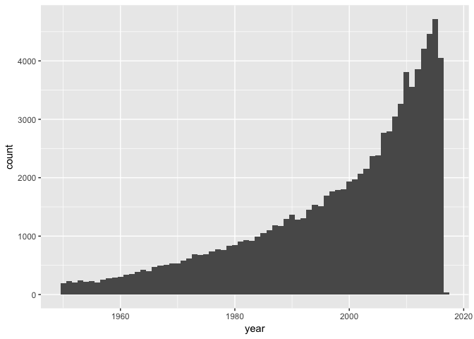
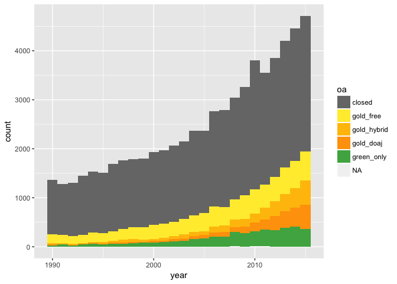
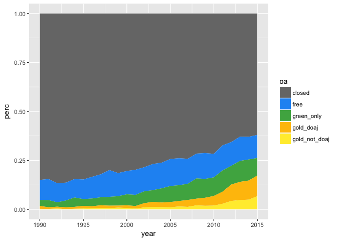
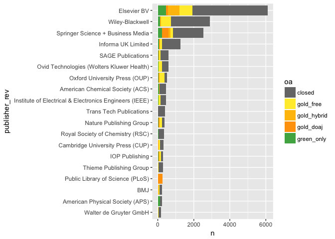
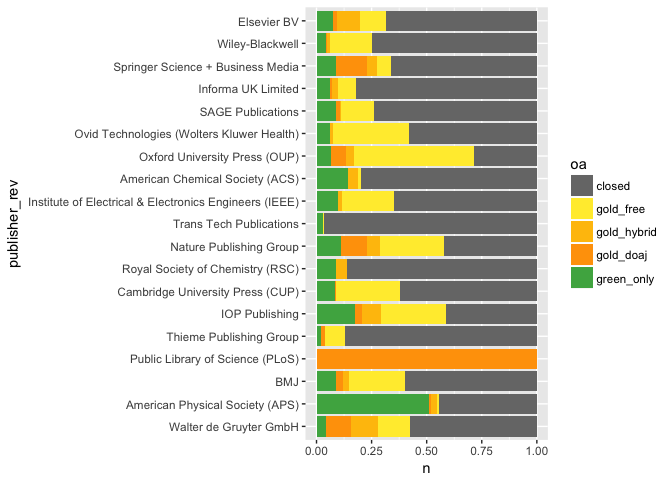
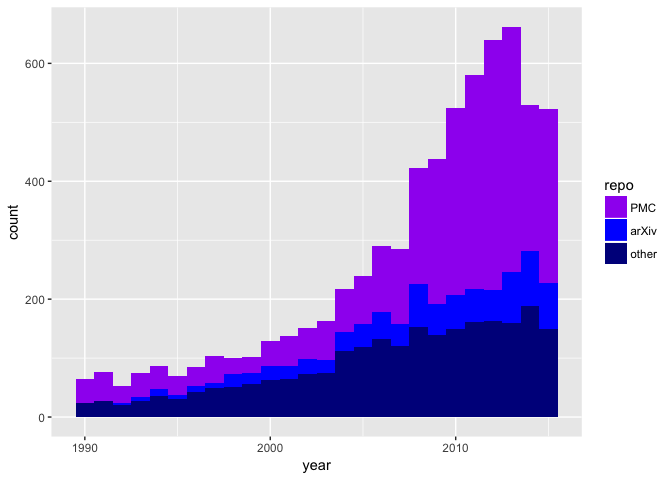
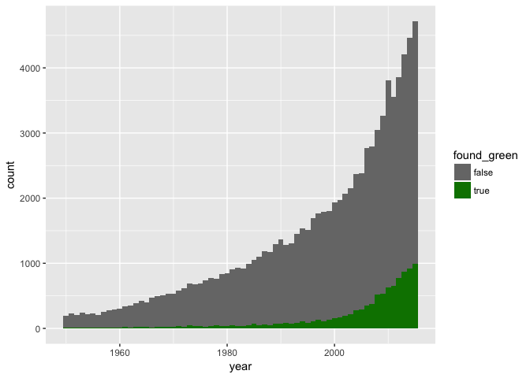
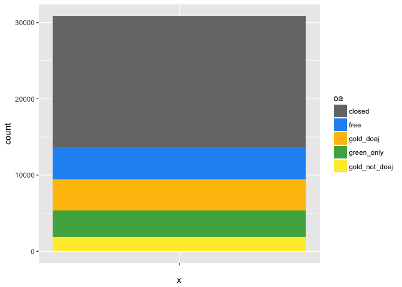
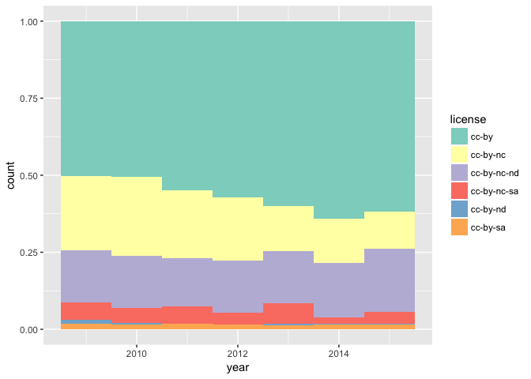

OA paper
================
many

*very much a work in progress. we're committing to this regularly.*

Results outline so far: - How accurate is our OA detection (from Juan, modified to use hybrid analysis) - How much OA is there? - How is open access changing over time? - How do OA patterns vary across publishers? - Which repositories contribute most to OA availability? - How do OA patterns vary by discipline? - How much OA is there in most highly-accessed papers? - Do different types of OA have different citation patterns?

\# How accurate is our OA detection
===================================

put juan's stuff here.

\# How much OA is there?
========================

``` r
articles_all %>% count(oa) %>% mutate(proportion=n/sum(n))
```

    ## # A tibble: 6 × 3
    ##            oa     n   proportion
    ##        <fctr> <int>        <dbl>
    ## 1      closed 72029 0.7214081827
    ## 2   gold_free 16202 0.1622715209
    ## 3 gold_hybrid  3586 0.0359156693
    ## 4   gold_doaj  3183 0.0318794131
    ## 5  green_only  4816 0.0482347639
    ## 6          NA    29 0.0002904502

Category definitions:

-   *closed*: We could not find a free fulltext copy.
-   *free*: There is a free-to-read copy on the publisher page, but no license is given and the journal is not in DOAJ.
-   *green\_only*: The article is Green OA. There is a fulltext copy of the article in one or more open repositories, but not on the publisher page.
-   *gold\_doaj* The article is Gold OA. There is a copy on the publisher page, and the journal is listed in the DOAJ.
-   *gold\_not\_doaj*: The article is Gold OA. There is a copy on the publisher page, under a Creative Commons license.

So, about 23% of the DOI-assigned literature is available to read. Given that we’re sampling from 65,838,767 total journal articles with a Crossref DOI, that means we can estimate there are *at least* 65838767 \* 0.232 = 15274594 free-to-read articles (15.2 million).

But we know that in recent years OA has been gaining steam, so let's let's look more closely at OA over time.

\# How is open access changing over time?
=========================================

How complete is the publication year data from Crossref?

``` r
articles_all %>% group_by(year <= 2017 & year >= 1500) %>% summarise(n())
```

    ## # A tibble: 3 × 2
    ##   `year <= 2017 & year >= 1500` `n()`
    ##                           <lgl> <int>
    ## 1                         FALSE     4
    ## 2                          TRUE 99411
    ## 3                            NA   430

It seems the year data is pretty good, with less than 0.1% missing or obviously wrong years. We don't really want to look at data since 1500, so let's see what's a reasonable window to examine. We'll try 1990 because it's comfortably before the "modern era" of open access.

``` r
# subset by time
articles_all = articles_all %>% mutate(is_modern = year >= 1990 & year <= 2017)
articles_all %>% filter(is_modern) %>%
    ggplot(aes(x=year)) + geom_bar(width=1) 
```



Unsurprisingly, we do not yet have enough data from 2017 to plot. More surprisingly, 2016 seems to be missing some data as well. Publishers can be slow to deposit information with Crossref, and this is likely the cause. So, we'll remove 2017 and 2016 from our timeseries subset.

``` r
articles_all = articles_all %>% mutate(is_modern = year >= 1990 & year <= 2015)
articles_all %>% count(is_modern) %>% mutate(proportion = n / sum(n))
```

    ## # A tibble: 3 × 3
    ##   is_modern     n  proportion
    ##       <lgl> <int>       <dbl>
    ## 1     FALSE 34559 0.346126496
    ## 2      TRUE 64856 0.649566829
    ## 3        NA   430 0.004306675

This subset will still cover nearly two thirds of all DOIs ever, while letting us zoom in on the years of interest.

We'll start with plotting absolute numbers of OA articles:

``` r
articles_all %>% filter(is_modern) %>%
    ggplot(aes(x=year, fill=oa)) + geom_bar(width=1) + oa_color_map
```



We can see the absolute number of free-to-read articles of all kinds is growing significantly. However, we're particularly interested in the by-year *proportion* of the literature that is free to read.

``` r
# see http://stackoverflow.com/questions/24576515/relative-frequencies-proportions-with-dplyr
oa_freq_by_year = articles_all %>% filter(is_modern) %>% count(year, oa) %>%  
  mutate(perc = n / sum(n)) %>%  
  ungroup()  

oa_freq_by_year %>% ggplot(aes(x=year, y=perc, fill=oa)) + geom_area() + oa_color_map
```



The proportion of OA is growing, too--not just the absolute amounts.

\# Publishers
=============

Let's look at publishers. We'll subset the years more tightly and just look at articles since 2009. This will let us look at the more up-to-date picture that may include OA publishers.

``` r
articles_recent = articles_all %>% filter(is_modern, year >= 2009)
articles_recent$publisher = fct_infreq(articles_recent$publisher)

publishers = articles_recent %>% count(publisher) %>%
  ungroup()

# the top 25 publishers publish 80% of articles.
# top 100 publshers publish 87% of articles.
sum(publishers$n[0:100]) /sum(publishers$n)
```

    ## [1] 0.8346847

``` r
#publishers %>% slice(1:25) %>% ggplot(aes(x=publisher, y=n)) + geom_bar(stat="identity") + coord_flip()

publishers_oa = articles_recent %>% 
  count(publisher, oa) %>%
  ungroup()


publishers_oa %>% slice(1:80) %>% mutate(publisher_rev=fct_rev(publisher)) %>% ggplot(aes(x=publisher_rev, y=n, fill=oa)) + 
  geom_bar(stat="identity") + 
  coord_flip() +
  oa_color_map
```



``` r
#same thing but by % oa

publishers_oa %>% slice(1:80) %>% mutate(publisher_rev=fct_rev(publisher)) %>% ggplot(aes(x=publisher_rev, y=n, fill=oa)) + 
  geom_bar(stat="identity", position="fill") + 
  coord_flip() +
  oa_color_map
```



From this we can see that Elsevier is massively outpublishing anyone else. Because of this, they are also publishing more open-access content than any other single publisher. However, in percentage terms other publshers are doing much better at making content open. Unsurprisingly, the American Physical Society stands out as having more Green OA than other publishers in percentage terms, because of the prevelance of the ArXiv in Physics. PLOS stands out as the only open-access-only publisher in the list of top publishers.

\# Repositories
===============

A different question is to dig into which repositories are contributing to making papers available. We know that PubMed Central and the ArXiv are both very popular repositories, so we will plot them seperately. We'll combine all other repositories, including the thousands of institutional repositories, into a single category for now. As a reminder, we are only looking here at articles that are *only* available from a green repository.

We can see in the graphs at

``` r
articles_all = articles_all %>% mutate(base_collection_string=as.character(green_base_collections))

articles_all$repo = NULL
articles_all$repo[articles_all$oa=="green_only"] = "other"
articles_all$repo[grepl('pmcid', articles_all$evidence)] = "PMC"
articles_all$repo[grepl('pubmed', articles_all$base_collection_string)] = "PMC"
articles_all$repo[grepl('arxiv', articles_all$base_collection_string)] = "arXiv"

repo_ordered_levels = c("PMC", "arXiv", "other")
articles_all = mutate(articles_all, repo=factor(repo, levels=repo_ordered_levels))

repo_color_map = scale_fill_manual(values=c("purple", "blue", "dark blue"))

articles_all %>% filter(is_modern) %>% filter(!is.na(repo)) %>% ggplot(aes(x=year, fill=repo)) + geom_bar(width=1) + repo_color_map
```



Again, it apprears that multi-year embargoes maybe affecting PMC. Regardless of this, PMC remains by far the most significant green repository, and a very important source of fulltext that would be otherwise unavailable.

``` r
articles_all %>% filter(year > 2009, oa=="green_only") %>% count(repo) %>% mutate(proportion=n/sum(n))
```

    ## # A tibble: 2 × 3
    ##     repo     n proportion
    ##   <fctr> <int>      <dbl>
    ## 1    PMC   723  0.3763665
    ## 2  other  1198  0.6236335

That said, smaller repositories are still making a significant contribution to Green OA, particularly in recent years. for articles published since 2009, the contribute about as much as PMC (42%).

Growth in literature over time with any green
---------------------------------------------

We are only counting something as "green" if it's not available in any other format (Gold, hybrid). However, it's also interesting to look at how many articles are available in a repository, regardless of where else they might be open. Let's take a look at that below:

``` r
gray_green_color_map = scale_fill_manual(values=c("#777777", "#008000", "#FFD700"))

articles_all %>% filter(is_modern) %>% ggplot(aes(x=year, fill=found_green)) + geom_bar(width=1) + gray_green_color_map
```

 As a proportion of all articles, deposits into repositories has been going up, with a recent drop. Embargos probaby play a large part in this, though deposit into places like ResearchGate (not included in our repository numbers) rather than institutional repositories may as well.

``` r
found_green_freq_by_year = articles_all %>% filter(is_modern) %>% count(year, found_green) %>%
  mutate(perc = n / sum(n)) %>%
  ungroup()
found_green_freq_by_year %>% ggplot(aes(x=year, y=perc, fill=found_green)) + geom_area() + gray_green_color_map
```



\# By license
=============

What are the most common licenses for open-access papers?

``` r
articles_all %>% filter(is_modern) %>% filter(grepl('cc', license)) %>% ggplot(aes(x=year, fill=license)) + geom_bar(width=1, position="fill") 
```

 It looks like there has been steady growth in the number of articles licensed with the CC-BY license, largely at the expense of the CC-BY-NC license.

Let's also look at CC licenses by type of OA

``` r
# articles_all %>% filter(is_modern) %>% filter(oa != "closed", oa != "free") %>% ggplot(aes(x=oa,  fill=license)) + geom_bar(width=1, position="fill") 
```

Most repositories do not note the license of the work, so green\_only is surely an undercount. It's interesting to see that DOAJ journals are more likely to use the more permissive CC-BY license. This graph needs different colors, so that license=NA is shown as gray.

\# By discipline
================

TBD

\# How much OA is there for most-accessed papers?
=================================================

DOIs accessed through Unpaywall on April 20, 2017. 50k accesses, 30k unique DOIs, 9k unique IP addresses. (we will fix the plots so the two types of gold are beside each other) This analysis is using the 30k DOIs.

To write: - describe unpaywall - describe userbase of unpaywall - the number of calls to the api - percent of dois with more than one accesses - number of unique IP addresses - DOI based analysis - we'll include one or two of these graphs, not sure which yet - for the most viewed articles, the OA story is better, and getting even better

``` r
# articles_accessed_raw <- read.csv("export_study_dois_unpaywall_accesses_20170511.csv")
# articles_accessed = articles_accessed_raw
# articles_accessed = mutate(articles_accessed, oa=factor(oa_color_long, levels=oa_ordered_levels))
# 
# # how much oa
# articles_accessed %>% count(oa) %>% mutate(proportion=n/sum(n))
# articles_accessed %>% ggplot(aes(x="", fill=oa)) + geom_bar() + oa_color_map
# 
# articles_accessed = articles_accessed %>% mutate(is_modern = year >= 1990 & year <= 2015)
# articles_accessed %>% count(is_modern) %>% mutate(proportion = n / sum(n))
# 
# articles_accessed %>% filter(is_modern) %>%
#     ggplot(aes(x=year, fill=oa)) + geom_bar(width=1) + oa_color_map
# 
# oa_freq_by_year = articles_accessed %>% filter(is_modern) %>% count(year, oa) %>%
#   mutate(perc = n / sum(n)) %>%
#   ungroup()
# 
# oa_freq_by_year %>% ggplot(aes(x=year, y=perc, fill=oa)) + geom_area() + oa_color_map
```

\# OA and citation patterns
===========================

put steffi and vincent's stuff in here.
