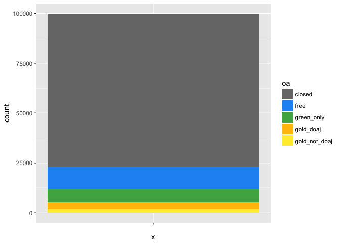
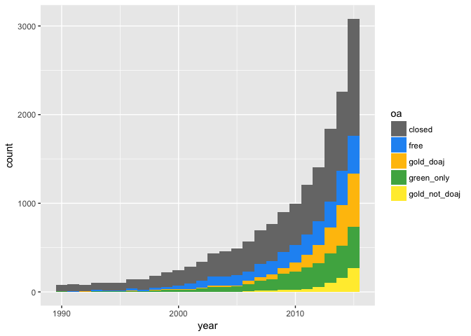
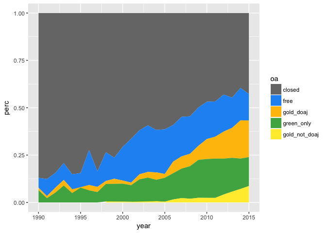

OA paper
================
many

*very much a work in progress. we're committing to this regularly, so it's going to be kinda crazy and hard to read until this evening (saturday, may 6).*

To do next - make table for amount of oa in last five years, more sentences describing j - comment out the single bar graph 1min

-   add a bunch more sentences to accessed section
-   fix labels on accessed section

-   put a TBD section for by discipline 1min
-   put TBD for "How accurate is our OA detection" and "Do different types of OA have different citation patterns?" 1min

-   say "under construction" for publisher, repos

decide what to do about - 2016 and 2017 are the most accessed years, but leaving them out of analysis

if time - fix publisher section - repository section needs help

for later - look into why 65mil not 75mil - multiply out so get total number of articles

Results outline - How accurate is our OA detection (from Juan, modified to use hybrid analysis) - How much OA is there? - How is open access changing over time? - How do OA patterns vary across publishers? - Which repositories contribute most to OA availability? - How do OA patterns vary by discipline? - How much OA is there in most highly-accessed papers? - Do different types of OA have different citation patterns?

Discussion - limitations - some free-to-read where we don't get it (ResearchGate, personal web pages) - articles without DOIs - future work - more citation, altmetrics studies - expounding on what this means for the future of OA - take-home - OA isn't evenly distributed, and there is more OA where it is more needed: in recent, highly accessed articles.

\# How much OA is there?
========================

``` r
articles_all %>% count(oa) %>% mutate(proportion=n/sum(n))
```

    ## # A tibble: 5 × 3
    ##              oa     n proportion
    ##          <fctr> <int>      <dbl>
    ## 1        closed 76854 0.76973309
    ## 2          free 11232 0.11249437
    ## 3    green_only  6264 0.06273724
    ## 4     gold_doaj  3559 0.03564525
    ## 5 gold_not_doaj  1936 0.01939005

``` r
articles_all %>% ggplot(aes(x="", fill=oa)) + geom_bar() + oa_color_map
```

 \* insert definitions of our colors here \*

So, about 23% of the DOI-assigned literature is available to read. But we know that in recent years OA has been gaining steam, so let's let's look more closely at OA over time.

\# How is open access changing over time?
=========================================

How complete is the publication year data from Crossref?

``` r
articles_all %>% group_by(year <= 2017 & year >= 1500) %>% summarise(n())
```

    ## # A tibble: 3 × 2
    ##   `year <= 2017 & year >= 1500` `n()`
    ##                           <lgl> <int>
    ## 1                         FALSE     4
    ## 2                          TRUE 99142
    ## 3                            NA   699

It seems the year data is pretty good, with less than 0.1% missing or obviously wrong years. We don't really want to look at data since 1500, so let's see what's a reasonable window to examine. We'll try 1990 because it's comfortably before the "modern era" of open access.

``` r
# subset by time
articles_all = articles_all %>% mutate(is_modern = year >= 1990 & year <= 2017)
articles_all %>% filter(is_modern) %>%
    ggplot(aes(x=year)) + geom_bar(width=1) 
```


Unsurprisingly, we do not yet have enough data from 2017 to plot. More surprisingly, 2016 seems to be missing some data as well. Publishers can be slow to deposit information with Crossref, and this is likely the cause. So, we'll remove 2017 and 2016 from our timeseries subset.

``` r
articles_all = articles_all %>% mutate(is_modern = year >= 1990 & year <= 2015)
articles_all %>% count(is_modern) %>% mutate(proportion = n / sum(n))
```

    ## # A tibble: 3 × 3
    ##   is_modern     n  proportion
    ##       <lgl> <int>       <dbl>
    ## 1     FALSE 34478 0.345315239
    ## 2      TRUE 64668 0.647683910
    ## 3        NA   699 0.007000851

This subset will still cover nearly two thirds of all DOIs ever, while letting us zoom in on the years of interest.

We'll start with plotting absolute numbers of OA articles:

``` r
articles_all %>% filter(is_modern) %>%
    ggplot(aes(x=year, fill=oa)) + geom_bar(width=1) + oa_color_map
```


We can see the absolute number of free-to-read articles of all kinds is growing significantly. However, we're particularly interested in the by-year *proportion* of the literature that is free to read.

``` r
# see http://stackoverflow.com/questions/24576515/relative-frequencies-proportions-with-dplyr
oa_freq_by_year = articles_all %>% filter(is_modern) %>% count(year, oa) %>%  
  mutate(perc = n / sum(n)) %>%  
  ungroup()  

oa_freq_by_year %>% ggplot(aes(x=year, y=perc, fill=oa)) + geom_area() + oa_color_map
```


The proportion of OA is growing, too--not just the absolute amounts.

publishers
==========

========================
========================

Let's look at publishers. We'll subset the years even further, so we can look at the more up-to-date picture that may include OA publishers.

``` r
# sort the publisher factor by frequency...helps in plotting.
articles_all$publisher = fct_infreq(articles_all$publisher)

publishers = articles_all %>% 
    filter(is_modern, year >= 2009) %>%
    count(publisher, oa) %>%
    arrange(desc(n)) %>%
    ungroup()

# the top 25 publishers publish 80% of articles.
# top 100 publshers publish 87% of articles.
sum(publishers$n[0:20]) /sum(publishers$n)
```

    ## [1] 0.5540006

``` r
publishers %>% slice(1:25) %>% ggplot(aes(x=publisher, y=n)) + geom_bar(stat="identity") + coord_flip()
```


Looking at top twenty publishers, we get about half of articles. Looks like there is a very long tail of smaller publishers.

coming soon: oa by publisher.

\# Repositories
---------------

Growth in literature over time with any green
---------------------------------------------

We are only counting something as "green" if it's not available in any other format (Gold, hybrid). However, it's also interesting to look at how many articles are being deposited in a repository, regardless of where else they might be open. Let's take a look at that below:

(TBD)

\# By license
-------------

What are the most common licenses for open-access papers?

``` r
articles_all %>% filter(is_modern) %>% filter(grepl('cc', license)) %>% ggplot(aes(x=year, fill=license)) + geom_bar(width=1, position="fill") 
```

 It looks like there has been steady growth in the number of articles licensed with the CC-BY license, largely at the expense of the CC-BY-NC license.

Let's also look at CC licenses by type of OA

``` r
articles_all %>% filter(is_modern) %>% filter(oa != "closed", oa != "free") %>% ggplot(aes(x=oa,  fill=license)) + geom_bar(width=1, position="fill") 
```

 Most repositories do not note the license of the work, so green\_only is surely an undercount. It's interesting to see that DOAJ journals are more likely to use the more permissive CC-BY license.

\# What are OA percents by most accessed
----------------------------------------

DOIs accessed through Unpaywall on April 20, 2017. 50k accesses, 30k unique DOIs, 9k unique IP addresses. (we will fix the plots so the two types of gold are beside each other) This analysis is using the 30k DOIs.

To write: - describe unpaywall - describe userbase of unpaywall - the number of calls to the api - percent of dois with more than one accesses - number of unique IP addresses - DOI based analysis - we'll include one or two of these graphs, not sure which yet - for the most viewed articles, the OA story is better, and getting even better

``` r
# articles accessed
articles_accessed_raw <- read.csv("export_study_dois_unpaywall_accesses_20170506.csv")
articles_accessed = articles_accessed_raw
articles_accessed = articles_accessed %>%
  mutate(is_open_license=(grepl("cc", license) | oa_color=="gold"))
articles_accessed$oa = "closed"
articles_accessed$oa[articles_accessed$oa_color=="green"] = "green_only"
articles_accessed$oa[articles_accessed$oa_color=="gold"] = "gold_doaj"
articles_accessed$oa[articles_accessed$oa_color=="blue" & articles_accessed$is_open_license] = "gold_not_doaj"
articles_accessed$oa[articles_accessed$oa_color=="blue" & !articles_accessed$is_open_license] = "free"

# sort the factor for easier plotting
oa_color_map_accessed = scale_fill_manual(values=c("#777777", "#2196F3", "#FFC107", "#4CAF50", "#FFEB3B"))
articles_accessed = mutate(articles_accessed, oa=fct_infreq(oa))

# how much oa
articles_accessed %>% count(oa) %>% mutate(proportion=n/sum(n))
```

    ## # A tibble: 5 × 3
    ##              oa     n proportion
    ##          <fctr> <int>      <dbl>
    ## 1        closed 17199 0.55752212
    ## 2          free  4207 0.13637395
    ## 3     gold_doaj  4108 0.13316477
    ## 4    green_only  3430 0.11118675
    ## 5 gold_not_doaj  1905 0.06175241

``` r
articles_accessed %>% ggplot(aes(x="", fill=oa)) + geom_bar() + oa_color_map_accessed
```


``` r
articles_accessed = articles_accessed %>% mutate(is_modern = year >= 1990 & year <= 2015)
articles_accessed %>% count(is_modern) %>% mutate(proportion = n / sum(n))
```

    ## # A tibble: 3 × 3
    ##   is_modern     n proportion
    ##       <lgl> <int>      <dbl>
    ## 1     FALSE 13326 0.43197510
    ## 2      TRUE 17209 0.55784628
    ## 3        NA   314 0.01017861

``` r
articles_accessed %>% filter(is_modern) %>%
    ggplot(aes(x=year, fill=oa)) + geom_bar(width=1) + oa_color_map_accessed
```



``` r
oa_freq_by_year = articles_accessed %>% filter(is_modern) %>% count(year, oa) %>%  
  mutate(perc = n / sum(n)) %>%  
  ungroup()  

oa_freq_by_year %>% ggplot(aes(x=year, y=perc, fill=oa)) + geom_area() + oa_color_map_accessed
```


