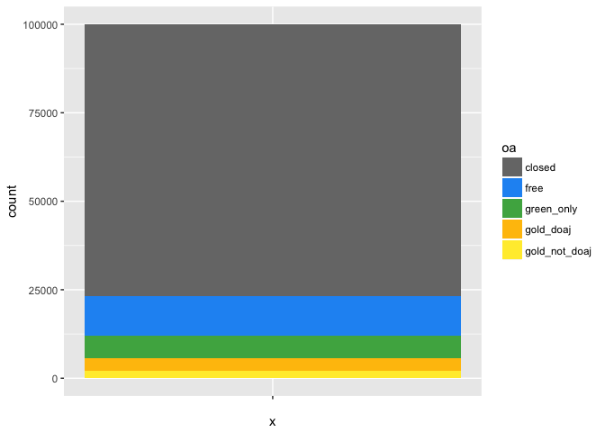
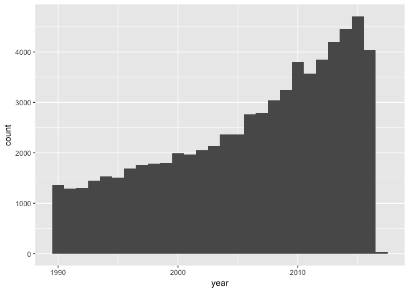

OA paper
================
many

*It's very much a work in progress; feel free to submit pull requests with updates and changes.*

``` r
2+3
```

    ## [1] 5

\# How much OA is there?
========================

``` r
articles_all %>% count(oa) %>% mutate(proportion=n/sum(n))
```

    ## # A tibble: 5 × 3
    ##              oa     n proportion
    ##          <fctr> <int>      <dbl>
    ## 1        closed 76758 0.76877160
    ## 2          free 11300 0.11317542
    ## 3    green_only  6293 0.06302769
    ## 4     gold_doaj  3559 0.03564525
    ## 5 gold_not_doaj  1935 0.01938004

``` r
articles_all %>% ggplot(aes(x="", fill=oa)) + geom_bar() + oa_color_map
```

 \* insert definitions of our colors here \*

So, about 23% of the DOI-assigned literature is available to read. But we know that in recent years OA has been gaining steam, so let's let's look more closely at OA over time.

\# How is open access changing over time?
=========================================

How complete is the publication year data from Crossref?

``` r
articles_all %>% group_by(year <= 2017 & year >= 1500) %>% summarise(n())
```

    ## # A tibble: 3 × 2
    ##   `year <= 2017 & year >= 1500` `n()`
    ##                           <lgl> <int>
    ## 1                         FALSE     4
    ## 2                          TRUE 99142
    ## 3                            NA   699

It seems the year data is pretty good, with less than 0.1% missing or obviously wrong years. We don't really want to look at data since 1500, so let's see what's a reasonable window to examine. We'll try 1990 because it's comfortably before the "modern era" of open access.

``` r
# subset by time
articles_all = articles_all %>% mutate(is_modern = year >= 1990 & year <= 2017)
articles_all %>% filter(is_modern) %>%
    ggplot(aes(x=year)) + geom_bar(width=1) 
```



Unsurprisingly, we do not yet have enough data from 2017 to plot. More surprisingly, 2016 seems to be missing some data as well. Publishers can be slow to deposit information with Crossref, and this is likely the cause. So, we'll remove 2017 and 2016 from our timeseries subset.

``` r
articles_all = articles_all %>% mutate(is_modern = year >= 1990 & year <= 2015)
articles_all %>% count(is_modern) %>% mutate(proportion = n / sum(n))
```

    ## # A tibble: 3 × 3
    ##   is_modern     n  proportion
    ##       <lgl> <int>       <dbl>
    ## 1     FALSE 34478 0.345315239
    ## 2      TRUE 64668 0.647683910
    ## 3        NA   699 0.007000851

This subset will still cover nearly two thirds of all DOIs ever, while letting us zoom in on the years of interest.

We'll start with plotting absolute numbers of OA articles:

``` r
articles_all %>% filter(is_modern) %>%
    ggplot(aes(x=year, fill=oa)) + geom_bar(width=1) + oa_color_map
```


We can see the absolute number of free-to-read articles of all kinds is growing significantly. However, we're particularly interested in the by-year *proportion* of the literature that is free to read.

``` r
# see http://stackoverflow.com/questions/24576515/relative-frequencies-proportions-with-dplyr
oa_freq_by_year = articles_all %>% filter(is_modern) %>% count(year, oa) %>%  
  mutate(perc = n / sum(n)) %>%  
  ungroup()  

oa_freq_by_year %>% ggplot(aes(x=year, y=perc, fill=oa)) + geom_area() + oa_color_map
```


The proportion of OA is growing, too--not just the absolute amounts.

publishers
==========

========================
========================

Let's look at publishers. We'll subset the years even further, so we can look at the more up-to-date picture that may include OA publishers.

``` r
# sort the publisher factor by frequency...helps in plotting.
articles_all$publisher = fct_infreq(articles_all$publisher)

publishers = articles_all %>% 
    filter(is_modern, year >= 2009) %>%
    count(publisher, oa) %>%
    arrange(desc(n)) %>%
    ungroup()

# the top 25 publishers publish 80% of articles.
# top 100 publshers publish 87% of articles.
sum(publishers$n[0:20]) /sum(publishers$n)
```

    ## [1] 0.5539286

``` r
publishers %>% slice(1:25) %>% ggplot(aes(x=publisher, y=n)) + geom_bar(stat="identity") + coord_flip()
```


Looking at top twenty publishers, we get about half of articles. Looks like there is a very long tail of smaller publishers.

``` r
publishers %>% slice(1:25) %>% ggplot(aes(x=publisher, y=n, fill=oa)) + 
  geom_bar(stat="identity") + 
  coord_flip() +
  oa_color_map
```


same thing but by % oa

``` r
publishers %>% slice(1:25) %>% ggplot(aes(x=publisher, y=n, fill=oa)) + 
  geom_bar(stat="identity", position="fill") + 
  coord_flip() +
  oa_color_map
```


Ending here...more to come laters.
